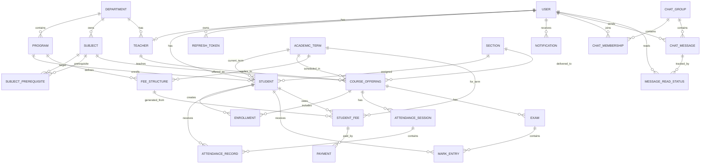

# Student Academic Management System

## 1. Scope

Backend-first academic management platform for a single institution with:

- authentication and RBAC
- academic master data
- student enrollment
- attendance
- exams, marks, and grading
- fee tracking
- notifications
- class and subject chat
- optional AI features

This document tightens the original roadmap into an implementation-ready spec and defines the core ER model.

## 2. Product Boundary

### In scope

- one institution
- three roles: `ADMIN`, `TEACHER`, `STUDENT`
- semester or term based academic flow
- teacher-owned academic operations
- admin-owned master data and policy operations
- student self-service views for profile, enrollment, attendance, results, fees, and notifications

### Out of scope for MVP

- parent role
- multi-campus tenancy
- public self-registration for teachers/admins
- external payment gateway integration
- video or file sharing in chat
- AI writes that mutate academic records

## 3. Recommended MVP Cut

Build MVP in this order:

1. foundation and project setup
2. auth and RBAC
3. master data
4. course offering and enrollment
5. attendance
6. exams and grading
7. fees
8. notifications

Hold these until after MVP:

- chat
- analytics dashboards
- AI features
- Redis and queue-based optimizations

## 4. Core Domain Decisions

### 4.1 Use `Subject` and `CourseOffering` as separate entities

`Subject` is the catalog definition.

Examples:

- Database Management Systems
- Operating Systems

`CourseOffering` is the term-specific, teachable unit.

Examples:

- DBMS for BSc CS Semester 4 Section A in 2026 Spring
- DBMS taught by Teacher X with capacity 60

All of these should attach to `CourseOffering` instead of plain `Subject`:

- enrollment
- attendance sessions
- marks
- chat groups for subject discussion
- capacity
- assigned teacher

### 4.2 Use account state as a first-class concept

Every user account should carry status:

- `ACTIVE`
- `SUSPENDED`
- `LOCKED`
- `DISABLED`

Student lifecycle can be modeled separately:

- `ACTIVE`
- `ON_HOLD`
- `GRADUATED`
- `DROPPED`

This prevents chat, attendance, fee, and exam rules from drifting across modules.

### 4.3 Centralize eligibility and policy checks

The system should not let each module invent its own eligibility logic.

Create one policy layer for checks like:

- can this student enroll?
- can this student sit for exams?
- is the hall ticket blocked?
- should this student receive a low attendance warning?

Inputs to policy evaluation:

- attendance shortage
- unpaid dues
- account status
- academic status
- enrollment window
- prerequisite completion
- result publication status

## 5. Roles and Access

### ADMIN

- manage users and roles
- create teachers and students
- manage departments, programs, sections, subjects, semesters, offerings
- configure fee rules, grade rules, enrollment windows
- view all reports
- moderate chat

### TEACHER

- view assigned offerings
- mark attendance for assigned offerings
- enter marks for assigned offerings
- publish announcements
- participate in assigned chat groups

### STUDENT

- view own profile
- enroll in allowed offerings
- view attendance, results, fees, notifications
- participate in allowed chat groups

## 6. Modules

### 6.1 Auth

- login
- refresh token
- get current profile
- password change
- optional password reset later

### 6.2 User and Identity

- user account
- role assignment
- account status
- audit timestamps

### 6.3 Academic Master Data

- department
- program
- academic term
- section
- subject
- prerequisite mapping
- teacher profile
- student profile

### 6.4 Course Offering

- offering for a subject in a specific term
- assigned teacher
- capacity
- enrollment window
- optional room/schedule metadata

### 6.5 Enrollment

- enroll student in offering
- validate duplicates
- validate capacity
- validate prerequisites
- validate fee and policy blocks

### 6.6 Attendance

- attendance session per offering and date
- student attendance records
- percentage calculations
- shortage flags

### 6.7 Exams and Grading

- exam definition
- mark entry
- grading rule
- publish result
- GPA and CGPA

### 6.8 Fees

- fee structure
- student fee ledger
- payment records
- due and overdue logic

### 6.9 Notifications

- in-app notifications
- scheduled jobs
- read/unread status

### 6.10 Chat

- chat groups
- membership
- messages
- moderation and pinned messages

### 6.11 AI

- read-only assistant workflows
- summarization and insights
- policy-aware guardrails

## 7. Suggested Package Structure

Feature-first structure is recommended:

```text
com.example.sams
  config
  common
  security
  auth
  user
  academic
  offering
  enrollment
  attendance
  grading
  fee
  notification
  chat
  ai
  audit
```

Keep shared building blocks in `common` only when they are truly cross-cutting:

- exception handling
- API response model
- base entity
- pagination helpers

## 8. Main Entities

### Identity and People

- `User`
- `RefreshToken`
- `Student`
- `Teacher`

### Academic Structure

- `Department`
- `Program`
- `AcademicTerm`
- `Section`
- `Subject`
- `SubjectPrerequisite`
- `CourseOffering`

### Transactional Academic Data

- `Enrollment`
- `AttendanceSession`
- `AttendanceRecord`
- `Exam`
- `MarkEntry`
- `GradeRule`
- `ResultPublication`

### Finance

- `FeeStructure`
- `StudentFee`
- `Payment`

### Communication

- `Notification`
- `ChatGroup`
- `ChatMembership`
- `ChatMessage`
- `MessageReadStatus`

### Governance

- `AuditLog`

## 9. Entity Notes

### User

Fields:

- `id`
- `username`
- `email`
- `password_hash`
- `role`
- `account_status`
- `last_login_at`
- audit fields

### Student

Fields:

- `id`
- `user_id`
- `student_code`
- `department_id`
- `program_id`
- `current_term_id`
- `section_id`
- `academic_status`
- `admission_date`
- audit fields

### Teacher

Fields:

- `id`
- `user_id`
- `employee_code`
- `department_id`
- `designation`
- audit fields

### Subject

Fields:

- `id`
- `code`
- `name`
- `credits`
- `department_id`
- `is_active`
- audit fields

### CourseOffering

Fields:

- `id`
- `subject_id`
- `term_id`
- `section_id`
- `teacher_id`
- `capacity`
- `enrollment_open_at`
- `enrollment_close_at`
- `status`
- audit fields

### Enrollment

Fields:

- `id`
- `student_id`
- `course_offering_id`
- `status`
- `enrolled_at`
- `dropped_at`
- audit fields

Unique rule:

- one active enrollment per student per offering

### AttendanceSession

Fields:

- `id`
- `course_offering_id`
- `session_date`
- `topic`
- `created_by_teacher_id`
- audit fields

Unique rule:

- one session per offering per date per slot, if slots are modeled

### AttendanceRecord

Fields:

- `id`
- `attendance_session_id`
- `student_id`
- `status`
- `marked_at`
- audit fields

Unique rule:

- one record per student per attendance session

### Exam

Fields:

- `id`
- `course_offering_id`
- `name`
- `max_marks`
- `weightage`
- `exam_date`
- `publish_status`
- audit fields

### MarkEntry

Fields:

- `id`
- `exam_id`
- `student_id`
- `marks_obtained`
- `entered_by_teacher_id`
- `finalized`
- audit fields

Unique rule:

- one mark entry per student per exam

### GradeRule

Fields:

- `id`
- `name`
- `min_score`
- `max_score`
- `grade`
- `grade_point`
- `active`

### FeeStructure

Fields:

- `id`
- `program_id`
- `term_id`
- `amount`
- `due_days`
- `late_fee_per_day`
- `active`
- audit fields

### StudentFee

Fields:

- `id`
- `student_id`
- `term_id`
- `fee_structure_id`
- `base_amount`
- `fine_amount`
- `paid_amount`
- `status`
- `due_date`
- audit fields

### Payment

Fields:

- `id`
- `student_fee_id`
- `amount`
- `payment_method`
- `transaction_reference`
- `paid_at`
- audit fields

### Notification

Fields:

- `id`
- `user_id`
- `type`
- `title`
- `body`
- `is_read`
- `read_at`
- audit fields

## 10. Cross-Module Rules

### Enrollment

- student must have `ACTIVE` account status
- student must have valid academic status
- enrollment must be inside offering window
- prerequisites must be satisfied
- student cannot enroll twice in the same offering
- offering capacity cannot be exceeded
- optional fee policy can block enrollment

### Attendance

- only assigned teacher or admin can create attendance sessions
- only enrolled students appear in attendance marking
- attendance records become read-only after configurable cutoff

### Exams

- only assigned teacher can enter marks
- students can see marks only after result publication
- GPA and CGPA are calculated from published results only

### Fees

- student fee status is derived, not manually set where possible
- partial payments must reduce outstanding amount
- overdue fine is computed from rule and due date

### Chat

- membership is derived from section or offering assignment where possible
- suspended or disabled users cannot send messages
- announcement channels are write-restricted

## 11. API Direction

Use plural, resource-oriented endpoints.

Examples:

- `POST /api/v1/auth/login`
- `POST /api/v1/auth/refresh`
- `GET /api/v1/users/me`
- `GET /api/v1/students`
- `POST /api/v1/course-offerings`
- `POST /api/v1/enrollments`
- `POST /api/v1/attendance-sessions`
- `POST /api/v1/exams`
- `POST /api/v1/payments`
- `GET /api/v1/notifications/me`

Avoid RPC-style naming like:

- `/createStudent`
- `/getAttendanceByStudentAndSemester`

## 12. Suggested Database Constraints

- unique `user.username`
- unique `user.email`
- unique `student.student_code`
- unique `teacher.employee_code`
- unique `subject.code`
- unique `(student_id, course_offering_id)` on active enrollment
- unique `(attendance_session_id, student_id)` on attendance record
- unique `(exam_id, student_id)` on mark entry

Also index:

- foreign keys
- notification lookup by `user_id, is_read`
- chat message lookup by `chat_group_id, created_at`
- attendance and mark lookup by `course_offering_id`

## 13. Non-Functional Requirements

- JWT-based stateless API auth
- refresh token persistence and revocation support
- Flyway-managed schema
- global exception handling
- audit timestamps on all mutable entities
- OpenAPI documentation
- integration tests for critical workflows

## 14. ER Model



## 15. Immediate Build Sequence

If we were starting implementation now, this is the safest order:

1. create base project, Flyway, security skeleton, and shared error handling
2. implement `User`, `Student`, `Teacher`, auth, refresh tokens, and RBAC
3. implement `Department`, `Program`, `AcademicTerm`, `Section`, `Subject`
4. implement `CourseOffering`
5. implement `Enrollment` with all validations
6. implement `AttendanceSession` and `AttendanceRecord`
7. implement `Exam`, `MarkEntry`, `GradeRule`
8. implement `FeeStructure`, `StudentFee`, `Payment`
9. implement notifications and schedulers
10. add chat
11. add reporting and AI

## 16. Recommended First Flyway Tables

For a clean start, the first schema wave should include:

- `users`
- `refresh_tokens`
- `departments`
- `programs`
- `academic_terms`
- `sections`
- `subjects`
- `subject_prerequisites`
- `teachers`
- `students`
- `course_offerings`
- `enrollments`

That gives you a stable base for all later modules.
